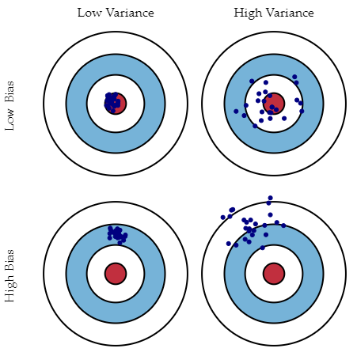
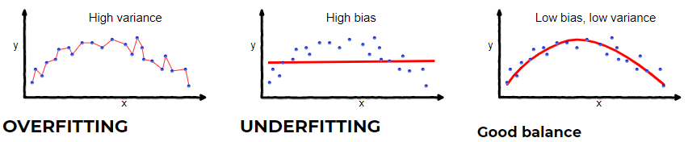

**Reference**

- http://scott.fortmann-roe.com/docs/BiasVariance.html
- http://www.machinelearningtutorial.net/2017/01/26/the-bias-variance-tradeoff/

## 1. Bias and Variance

- Target 변수와 관측 변수 간의 관계가 $$ \mathbf{Y} = f(\mathbf{X}) + \epsilon $$ 라고 가정하자.
  - $$ \mathbf{Y} $$ : 예측하고자 하는 변수(Target)
  - $$ \mathbf{X} $$ : 관측 변수
  - $$ \epsilon\sim\mathcal{N}(0,\sigma_\epsilon) $$ : 평균이 0인 정규분포를 따르는 오차
  - $$ f(\mathbf{X}) $$ : $$ \mathbf{Y} $$ 값을 예측하는 함수
  - $$ \hat{f}(\mathbf{X}) $$ : 학습을 통해 $$ f(\mathbf{X}) $$를 추정하는 함수
  

- 어느 한 점 $$ x $$에서의 제곱 예측 오차
  - $$ Err(x) = E[(Y - \hat{f}\left(x\right))^2] $$  
  - $$ Err(x) = (E[\hat{f}\left(x\right)] - f\left(x\right))^2 +
    E[(\hat{f}\left(x\right) - E[\hat{f}\left(x\right)])^2] + \sigma_e^2 $$  
  - $$ Err(x) = Bias^2 + Variance + Irreducible\ Error $$
  

- Error due to **Bias**
  - 모델의 잘못된 가정으로 인한 오차이다.
  - 예측 값과 실제 값의 차이이다.

- Error due to **Variance**
  - 주어진 데이터 포인트에 대한 모델 예측의 변동성이다.
  - 예측 값들간의 차이이다.

- Irreducible Error
  - 데이터의 잡음으로 인한 오차이다.
  

  

## 2. Why is there a tradeoff?

- 모델이 너무 단순하고 parameter가 적으면 Variance가 적지만, 과소적합되어 Bias가 커질 수 있다.
- 모델이 너무 복잡하고 parameter가 많으면 Bias는 작아지지만, 과대적합되어 Variance가 커질 수 있다.
- 그래서 Bias와 Variance는 Tradeoff이다.
- 모델이 데이터를 과적합하지 않으면서 충분한 복잡성을 갖도록 적절한 균형을 찾기 위해 노력해야 한다.
