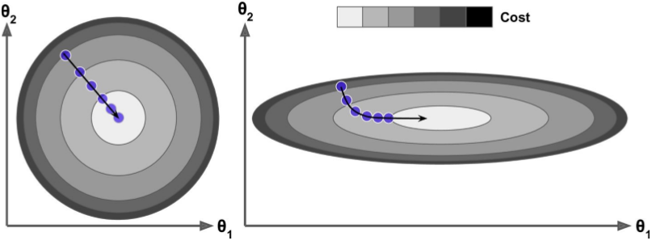

## 4. 모델 훈련

- 머신러닝 작동 원리를 이해해보자.
  - 머신러닝 모델과 훈련 알고리즘이 어떻게 작동하는지 잘 이해하고 있으면, 효율적으로 분석하는 데 도움이 된다.
    - 적절한 모델
    - 올바른 훈련 알고리즘
    - 작업에 맞는 좋은 하이퍼파라미터
  

- 모델을 훈련시키는 두 가지 방법을 살펴본다.
  - 직접 계산할 수 있는 공식을 사용하는 방법
  - 경사 하강법(GD)이라 불리는 반복적인 최적화 방식을 사용하는 방법
  

## 4.1 선형 회귀

- 선형 회귀 모델의 예측
  - $$ \hat{y}=\theta_{0}+\theta_{1}x_{1}+\cdots+\theta_{n}x_{n} $$
  - $$ \hat{y} $$ : 예측값
  - $$ n $$ : 특성 수
  - $$ \theta_{0} $$ : 편향
  

- 선형 회귀 모델의 예측 (벡터 형태)
  - $$ \hat{y}=h_\theta(\mathbf{x})=\theta^T\cdot\mathbf{x} $$
  - $$ h_\theta $$ : 가설함수
  - $$ \theta=[\theta_{0}\ \theta_{1}\ \cdots\ \theta_{n}]^T $$ : 모델의 파라미터 벡터 ($$ \theta_{0} $$ 포함)
  - $$ \mathbf{x}=[x_{0}\ x_{1}\ \cdots\ x_{n}]^T $$ : 특성 벡터 ($$ x_{0} $$는 항상 1)
  

- 모델을 훈련시킨다는 것은 모델이 훈련 세트에 가장 잘 맞도록 모델 파라미터를 설정하는 것이다.
  

- 먼저 모델이 훈련 데이터에 얼마나 잘 들어 맞는지 측정해야 한다.
  - 비용 함수를 최소화하는 $$ \theta $$를 찾아야 한다.
  

- 선형 회귀 모델의 MSE 비용 함수
  - $$ MSE(\mathbf{X}, h_\theta)=\cfrac{1}{m}\sum_{i=1}^{m} (\theta^T\cdot\mathbf{x}^\left(i\right) - y^\left(i\right))^2 $$
  

- 비용 함수를 최소화하는 모델 파라미터의 조합을 파라미터 공간이라고 한다.
  

**4.1.1 정규방정식**

- 비용함수를 최소화하는 $$ \theta $$ 값을 찾기 위해 해석적인 방법이 있다.
  

- 정규방정식
  - $$ \hat{\theta}=(\mathbf{X}^T\cdot\mathbf{X})^{-1}\cdot\mathbf{X}^T\cdot\mathbf{y} $$
  - $$ \hat{\theta} $$ : 비용 함수를 최소화하는 $$ \theta $$ 값
  - $$ \mathbf{y} $$ : 타깃벡터
  

**4.1.2 계산 복잡도**

- 정규방정식은 역행렬을 계산한다.
  - 일반적으로 역행렬 계산 복잡도는 $$ O(n^{2.4}) $$ 에서 $$ O(n^3) $$ 사이이다.
  - 따라서, 특성 수가 두 배로 늘어나면 계산 시간이 대략 8배로 증가할 수 있다.
  

- 정규방정식의 복잡도는 훈련 세트의 샘플 수에는 선형적으로 증가한다.($$ O(m) $$)
  - 메모리 공간이 허락된다면 큰 훈련 세트도 효율적으로 처리할 수 있다.
  

- 정규방정식으로 학습된 선형 회귀 모델은 예측이 매우 빠르다.
  - 예측 계산 복잡도는 샘플 수와 특성 수에 선형적이다.
  

## 4.2 경사 하강법

- 경사 하강법(GD:Gradient Descent)은 여러 종류의 문제에서 최적의 해법을 찾을 수 있는 일반적인 최적화 알고리즘이다.
  - 기본 아이디어는 비용 함수를 최소화하기 위해 반복해서 파라미터를 조정해가는 것이다.
    - 파라미터 벡터 $$ \theta $$를 임의의 값으로 시작한다(무작위 초기화).
    - $$ \theta $$에 대해 비용 함수의 현재 그래디언트를 계산한다.
    - 그래디언트가 감소하는 방향(비용 함수가 감소하는 방향)으로 진행한다.
    - 그래디언트가 0이 되면 최솟값에 도달한 것이다(수렴).
  

- 경사 하강법에서는 학습률(learning rate)이 중요한 하이퍼파라미터다.  
  
  - 학습률은 스텝의 크기이다.
  - 학습률이 너무 작으면 알고리즘이 수렴하기 위해 반복을 많이 진행해야 한다.  
  
  - 학습률이 너무 크면 알고리즘이 더 큰 값으로 발산할지도 모른다.  
  
  

- 경사 하강법에는 두 가지 문제점이 있다.  
  
  - 무작위 초기화 때문에 알고리즘이 왼쪽에서 시작하면 전역 최솟값보다 덜 좋은 지역 최솟값에 수렴한다.
  - 알고리즘이 오른쪽에서 시작하 평탄한 지역을 지나기 위해 시간이 오래 걸리고 일찍 멈추게 되어 전역 최솟값에 도달하지 못한다.
  - 다행히 선형 회귀를 위한 MSE 비용 함수는 볼록 함수이다.
    - 지역 최솟값이 없고, 하나의 전역 최솟값만 있다.
    - 연속 함수이고 기울기가 갑자기 변하지 않는다.
    - 따라서, 경사 하강법이 전역 최솟값에 가깝게 접근할 수 있다는 것을 보장한다(학습률이 너무 높지 않고 충분한 시간이 주어지면).
  

- 특성 스케일이 매우 다르면 길쭉한 모양일 수 있다.  
  
  - 왼쪽 그래프에서는 최솟값으로 곧장 진행하여 빠르게 도달했다.
  - 오른쪽 그래프에서는 평면한 골짜기를 길게 돌아서가 최솟값에 도달하는데 시간이 오래 걸린다.
  - 따라서, 경사 하강법을 사용할 때는 반드시 모든 특성이 같은 스케일을 갖도록 해야 한다.
  

**4.2.1 배치 경사 하강법**

- 경사 하강법을 구현하려면 각 모델 파라미터 $$ \theta_{j} $$에 대해 비용 함수의 그래디언트를 계산해야 한다.
  - $$ \theta_{j} $$가 변경될 때 비용 함수가 얼마나 바뀌는지 계산한다(편도함수).
  

- 비용 함수의 편도함수
  - $$ \cfrac{\partial}{\partial \theta_j}MSE(\theta)=
    \cfrac{2}{m} \sum_{i=1}^{m} (\theta^T \cdot \mathbf{x}^\left(i\right) - y^\left(i\right)) x_j^\left(i\right) $$
  

- 비용 함수의 그래디언트 벡터
  - $$ \nabla_{\theta}MSE(\theta)=
    \begin{bmatrix}
      \cfrac{\partial}{\partial \theta_0}MSE(\theta) \\
      \cfrac{\partial}{\partial \theta_1}MSE(\theta) \\
      \vdots \\
      \cfrac{\partial}{\partial \theta_n}MSE(\theta)
    \end{bmatrix}=
    \cfrac{2}{m}\mathbf{X}^T\cdot(\mathbf{X}\cdot\theta-\mathbf{y}) $$
  

- 배치 경사 하강법은 매 경사 하강법 스텝에서 전체 훈련 세트 $$ \mathbf{X} $$에 대해 계산한다.
  - 즉, 매 스텝에서 훈련 데이터 전체를 사용한다.
  - 따라서, 큰 훈련 세트에서는 아주 느리다.
  - 그러나, 특성 수에 민감하지 않다.
    - 수십만 개의 특성에서 선형 회귀를 훈련시키려면 정규방정식보다 경사 하강법을 사용하는 편이 훨씬 빠르다.
  

- 경사 하강법의 스텝
  - 위로 향하는 그래디언트 벡터가 구해지면 반대 방향인 아래로 가야 한다.
  - $$ \theta^\left({next\ step}\right)=\theta-\eta\nabla_{\theta}MSE(\theta) $$
  - $$ \eta $$ : 내려가는 스텝의 크기(learning rate)
  

- 적절한 학습률을 찾으려면 그리드 탐색을 사용해야 하지만, 수렴하는 데 너무 오래 걸리는 모델을 막기 위해 반복 횟수를 제한해야 한다.
  - 반복 횟수가 너무 작으면 최적점에 도달하기 전에 알고리즘이 멈춘다.
  - 반복 횟수가 너무 크면 모델 파라미터가 더 이상 변하지 않는 동안 시간을 낭비한다.
  - 해결책으로, 반복 횟수를 아주 크게 지정하고 그래디언트 벡터가 아주 작아지면 알고리즘을 중지한다.
  

**4.2.2 확률적 경사 하강법**

- 확률적 경사 하강법(SGD)은 매 스텝에서 딱 한 개의 샘플을 무작위로 선택하고 그 하나의 샘플에 대한 그래디언트를 계산한다.
  - 매 반복에서 매우 적은 데이터만 처리하기 때문에 알고리즘이 훨씬 빠르다.
  - 매 반복에서 하나의 샘플만 메모리에 있으면 되므로 매우 큰 훈련 세트도 훈련시킬 수 있다.
  

- 확률적(무작위)이기 때문에 이 알고리즘은 배치 경사 하강법보다 훨씬 불안정하다.
  - 비용 함수가 최솟값에 다다를 때까지 부드럽게 감소하지 않고 위아래로 요동치면서 평균적으로 감소한다.
  - 알고리즘이 멈출 때 좋은 파라미터가 구해지지만 최적치는 아니다.
  

- 비용 함수가 매우 불규칙할 경우 알고리즘이 지역 최솟값을 건너뛸 수 있도록 도와준다.
  - 배치 경사 하강법보다 전역 최솟값을 찾을 가능성이 높다.
  

- 무작위성의 딜레마를 해결하기 위해 학습률을 점진적으로 감소시키는 방법이 있다.
  - 시작할 때는 학습률을 크게 하고, 점차 작게 줄여서 알고리즘이 전역 최솟값에 도달하게 한다.
  - 매 반복에서 학습률을 결정하는 함수를 학습 스케줄라고 한다.
  - 학습률이 너무 빠르게 줄면 지역 최솟값에 갇히거나 최솟값까지 가는 중간에 멈출 수 있다.
  - 학습률이 너무 천천히 줄면 오랫동안 최솟값 주변을 맴돌거나 훈련을 너무 일찍 중지해서 지역 최솟값에 머물 수 있다.
  

- 한 반복에서 훈련세트의 샘플 수만큼 되풀이 될 때, 각 반복을 에포크라고 한다.
  

**4.2.3 미니배치 경사 하강법**

- 미니배치 경사 하강법은 임의의 작은 샘플 세트에 대해 그래디언트를 계산한다.
  - 미니배치를 어느 정도 크게 하면 파라미터 공간에서 SGD보다 덜 불규칙하게 움직인다.
  - 따라서, SGD보다 최솟값에 더 가까이 도달하게 된다.
  

**정리**

- 배치 경사 하강법에는 매 스텝에서 많은 시간이 소요된다.
- 확률적 경사 하강법과 미니배치 경사 하강법은 적절한 학습 스케줄을 사용하면 최솟값에 도달한다.

| 알고리즘 | 훈련 샘플 수가 클 때 | 외부 메모리 학습 지원 | 특성 수가 클 때 | 하이퍼파라미터 수 | 스케일 조정 필요 |
|:-|:-|:-|:-|:-|:-|
| 정규방정식 | 빠름 | No | 느림 | 0 | No |
| 배치 경사 하강법 | 느림 | No | 빠름 | 2 | Yes |
| 확률적 경사 하강법 | 빠름 | Yes | 빠름 | 2 이상 | Yes |
| 미니배치 경사 하강법 | 빠름 | Yes | 빠름 | 2 이상 | Yes |

  

## 4.3 다항 회귀

- 비선형 데이터를 학습하는 데 선형 모델을 사용할 수 있다.
  - 각 특성의 거듭제곱을 새로운 특성으로 추가하여 선형 모델을 훈련시킨다.
  - 다항 회귀에서는 특성이 여러 개일 때 특성 사이의 관계를 찾을 수 있다(특성 간의 교차항을 추가하기 때문).
  - `PolynomialFeatures` : 주어진 차수까지 각 특성의 거듭제곱과 특성 간의 모든 교차항 만드는 함수 (sklearn)
  

## 4.4 학습 곡선

- 고차 다항 회귀  
  
  

- 모델의 일반화 성능을 추정하기 위해 교차 검증을 사용한다.
  - 훈련 데이터에서 성능이 좋지만 교차 검증 점수가 나쁘면 모델이 과대적합된 것이다.
  - 양쪽 모두 좋지 않으면 과소적합된 것이다.
  

- 모델의 일반화 성능을 추정하기 위해 학습 곡선을 보는 방법도 있다.
  

- 선형 회귀의 학습 곡선  
  
  - 훈련 세트
    - 훈련 세트에 샘플이 추가됨에 따라 노이즈도 있고 비선형이기 때문에 모델이 훈련 데이터를 완벽히 학습하는 것이 불가능하다.
    - 곡선이 어느 정도 평편해질 때까지 오차가 계속 상승한다.
    - 이 위치에서는 훈련 세트에 샘플이 추가되어도 오차가 크게 나아지거나 나빠지지 않는다.
  - 검증 세트
    - 적은 수의 훈련 샘플로 모델이 훈련될 때는 제대로 일반화될 수 없어 검증 오차가 초기에 매우 크다.
    - 모델에 훈련 샘플이 추가됨에 따라 학습이 되고 검증 오차가 천천히 감소한다.
  - 하지만, 이 학습 곡선은 과소적합된 모델의 전형적인 모습이다.
    - 큰 오차에서 두 곡선이 수평한 구간을 만들고 가까이 근접해 있다.
  - 모델이 과소적합되어 있다면 훈련 샘플을 더 추가해도 효과가 없다.
    - 더 복잡한 모델을 사용하거나 더 나은 특성을 선택해야 한다.
  

- 다항 회귀의 학습 곡선  
  
  - 훈련 데이터의 오차가 선형 회귀 모델보다 훨씬 낮다.
  - 두 곡선 사이에 공간이 넓다.
    - 훈련 데이터에서의 모델 성능이 검증 데이터에서보다 훨씬 낫다.
    - 과대적학된 모델의 특징이다.
    - 그러나, 더 큰 훈련 세트를 사용하면 두 곡선이 점점 가까워진다.
  

- 편향/분산 트레이드오프
  - 모델의 일반화 오차는 세 가지 다른 종류의 오차의 합으로 표현할 수 있다.
  - 편향
    - 잘못된 가정으로 인한 것이다.
    - 데이터가 실제로는 2차인데 선형으로 가정하는 경우이다.
    - 편향이 큰 모델은 훈련 데이터에 과소적합되기 쉽다.
  - 분산
    - 훈련 데이터에 있는 작은 변동에 모델이 과도하게 민감하기 때문에 나타난다.
    - 자유도가 높은 모델(고차 다항 회귀 모델)이 높은 분산을 가지기 쉬워 훈련 데이터에 과대적합되는 경향이 있다.
  - 줄일 수 없는 오차
    - 데이터 자체에 있는 노이즈 때문에 발생한다.
    - 이 오차를 줄일 수 있는 유일한 방법은 데이터에서 노이즈를 제거하는 것이다.
  - 모델의 복잡도가 커지면 일반적으로 분산이 늘어나고 편향은 줄어든다.
  - 모델의 복잡도가 줄어들면 편향이 커지고 분산은 작아진다.
  - 그래서 편향과 분산은 트레이드오프이다.
  

## 4.5 규제가 있는 선형 모델

- 과대적합을 감소시키는 좋은 방법 중 하나는 모델을 규제하는 것이다.
  

**4.5.1 릿지 회귀**

- 규제항 $$ \alpha \sum_{i=1}^{n} \theta_i^2 $$ (가중치 벡터의 $$ l_2 $$ 노름 제곱을 2로 나눈것) 이 비용 함수에 추가된다.
  - 학습 알고리즘을 데이터에 맞투는 것뿐만 아니라 모델의 가중치가 가능한 한 작게 유지되도록 노력한다.
  - 규제항은 훈련하는 동안에만 비용 함수에 추가된다.
  - 모델의 훈련이 끝나면 모델의 성능을 규제가 없는 성능 지표로 평가한다.
  

- 릿지 회귀의 비용 함수
  - $$ J(\theta) = MSE(\theta) + \alpha \cfrac{1}{2} \sum_{i=1}^{n} \theta_i^2 $$
  - 하이퍼파라미터 $$ \alpha $$는 모델을 얼마나 많이 규지할지 조절한다.
    - $$ \alpha = 0 $$ 이면 선형 회귀와 같아진다.
    - $$ \alpha $$ 가 아주 크면 모든 가중치가 거의 0에 가까워지고 결국 데이터의 평균을 지나는 수평선이 된다.
  - $$ \theta_0 $$ 는 규제되지 않는다.
  - 경사 하강법에 적용하려면 MSE 그래디언트 벡터에 $$ \alpha w $$ 를 더하면 된다.
  

- 릿지 회귀는 입력 특성의 스케일에 민감하기 때문에 수행하기 전에 데이터의 스케일을 맞추는 것이 중요하다.
  - 규제가 있는 모델은 대부분 마찬가지다.
  

**4.5.2 라쏘 회귀**

- 가중치 벡터의 $$ l_1 $$ 노름이 비용 함수에 추가된다.
  - 덜 중요한 특성의 가중치를 완전히 제거하려고 한다(즉, 가중치가 0이 된다).
  

- 라쏘 회귀의 비용 함수
  - $$ J(\theta) = MSE(\theta) + \alpha \sum_{i=1}^{n} |\theta_i| $$
  

- 라쏘 및 릿지 규제  
  
  - 파란색 등고선은 규제가 없는($$ \alpha = 0 $$) MSE 비용 함수를 나타낸다.
  - 하얀색 원은 이 비용 함수에 대한 배치 경사 하강법의 경로이다.
  -

**4.5.3 엘라스틱넷**

**4.5.4 조기 종료**
