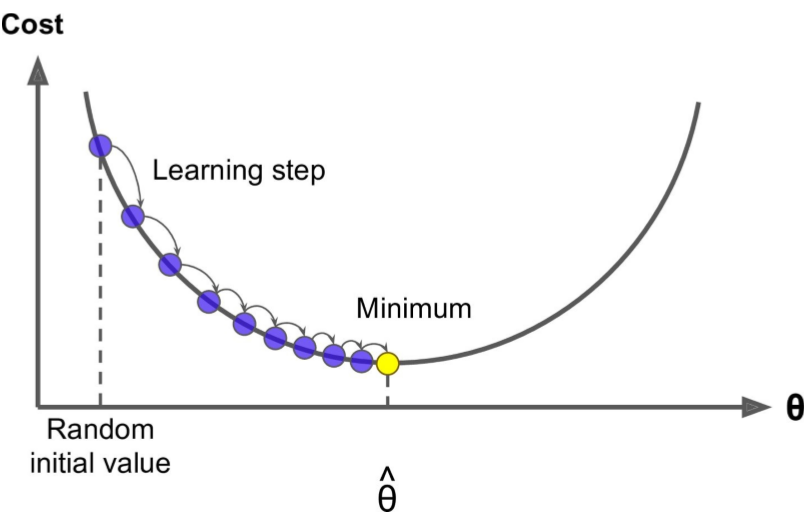

## 4. 모델 훈련

- 머신러닝 작동 원리를 이해해보자.
  - 머신러닝 모델과 훈련 알고리즘이 어떻게 작동하는지 잘 이해하고 있으면, 효율적으로 분석하는 데 도움이 된다.
    - 적절한 모델
    - 올바른 훈련 알고리즘
    - 작업에 맞는 좋은 하이퍼파라미터
 

- 모델을 훈련시키는 두 가지 방법을 살펴본다.
  - 직접 계산할 수 있는 공식을 사용하는 방법
  - 경사 하강법(GD)이라 불리는 반복적인 최적화 방식을 사용하는 방법
 

## 4.1 선형 회귀

- 선형 회귀 모델의 예측
  - $$ \hat{y}=\theta_{0}+\theta_{1}x_{1}+\cdots+\theta_{n}x_{n} $$
  - $$ \hat{y} $$ : 예측값
  - $$ n $$ : 특성 수
  - $$ \theta_{0} $$ : 편향
 

- 선형 회귀 모델의 예측 (벡터 형태)
  - $$ \hat{y}=h_\theta(\mathbf{x})=\theta^T\cdot\mathbf{x} $$
  - $$ h_\theta $$ : 가설함수
  - $$ \theta=[\theta_{0}\ \theta_{1}\ \cdots\ \theta_{n}]^T $$ : 모델의 파라미터 벡터 ($$ \theta_{0} $$ 포함)
  - $$ \mathbf{x}=[x_{0}\ x_{1}\ \cdots\ x_{n}]^T $$ : 특성 벡터 ($$ x_{0} $$는 항상 1)
 

- 모델을 훈련시킨다는 것은 모델이 훈련 세트에 가장 잘 맞도록 모델 파라미터를 설정하는 것이다.
 

- 먼저 모델이 훈련 데이터에 얼마나 잘 들어 맞는지 측정해야 한다.
  - 회귀에 사용되는 성능 측정 지표인 RMSE, MSE는 2장에서 언급했다.
  - 비용 함수를 최소화하는 $$ \theta $$를 찾아야 한다.
 

- 선형 회귀 모델의 MSE 비용 함수
  - $$ MSE(\mathbf{X}, h_\theta)=\frac{1}{m}\sum_{i=i}^m (\theta^T\cdot\mathbf{x}^\left(i\right) - y^\left(i\right))^2 $$
 

**4.1.1 정규방정식**

- 비용함수를 최소화하는 $$ \theta $$ 값을 찾기 위해 해석적인 방법이 있다.
 

- 정규방정식
  - $$ \hat{\theta}=(\mathbf{X}^T\cdot\mathbf{X})^{-1}\cdot\mathbf{X}^T\cdot\mathbf{y} $$
  - $$ \hat{\theta} $$ : 비용 함수를 최소화하는 $$ \theta $$ 값
  - $$ \mathbf{y} $$ : 타깃벡터
 

**4.1.2 계산 복잡도**

- 정규방정식은 역행렬을 계산한다.
  - 일반적으로 역행렬 계산 복잡도는 $$ O(n^{2.4}) $$ 에서 $$ O(n^3) $$ 사이이다.
  - 따라서, 특성 수가 두 배로 늘어나면 계산 시간이 대략 8배로 증가할 수 있다.
 

- 정규방정식의 복잡도는 훈련 세트의 샘플 수에는 선형적으로 증가한다.($$ O(m) $$)
  - 메모리 공간이 허락된다면 큰 훈련 세트도 효율적으로 처리할 수 있다.
 

- 정규방정식으로 학습된 선형 회귀 모델은 예측이 매우 빠르다.
  - 예측 계산 복잡도는 샘플 수와 특성 수에 선형적이다.
 

## 4.2 경사 하강법

- 경사 하강법(GD:Gradient Descent)은 여러 종류의 문제에서 최적의 해법을 찾을 수 있는 일반적인 최적화 알고리즘이다.
  - 기본 아이디어는 비용 함수를 최소화하기 위해 반복해서 파라미터를 조정해가는 것이다.
    - 파라미터 벡터 $$ \theta $$를 임의의 값으로 시작한다(무작위 초기화).
    - $$ \theta $$에 대해 비용 함수의 현재 그래디언트를 계산한다.
    - 그래디언트가 감소하는 방향(비용 함수가 감소하는 방향)으로 진행한다.
    - 그래디언트가 0이 되면 최솟값에 도달한 것이다(수렴).
 

- 경사 하강법에서는 학습률(learning rate)이 중요한 하이퍼파라미터다.  
  
  - 학습률은 스텝의 크기이다.
  - 학습률이 너무 작으면 알고리즘이 수렴하기 위해 반복을 많이 진행해야 한다.
  - 학습률이 너무 크면 알고리즘이 더 큰 값으로 발산할지도 모른다.
 

- 경사 하강법에는 두 가지 문제점이 있다.  
  
  - 무작위 초기화 때문에 알고리즘이 왼쪽에서 시작하면 전역 최솟값보다 덜 좋은 지역 최솟값에 수렴한다.
  - 알고리즘이 오른쪽에서 시작하 평탄한 지역을 지나기 위해 시간이 오래 걸리고 일찍 멈추게 되어 전역 최솟값에 도달하지 못한다.
  - 다행히 선형 회귀를 위한 MSE 비용 함수는 볼록 함수이다.
    - 지역 최솟값이 없고, 하나의 전역 최솟값만 있다.
    - 연속 함수이고 기울기가 갑자기 변하지 않는다.
    - 따라서, 경사 하강법이 전역 최솟값에 가깝게 접근할 수 있다는 것을 보장한다(학습률이 너무 높지 않고 충분한 시간이 주어지면).
 

- 특성 스케일이 매우 다르면 길쭉한 모양일 수 있다.  
  
  - 왼쪽 그래프에서는 최솟값으로 곧장 진행하여 빠르게 도달했다.
  - 오른쪽 그래프에서는 평면한 골짜기를 길게 돌아서가 최솟값에 도달하는데 시간이 오래 걸린다.
  - 따라서, 경사 하강법을 사용할 때는 반드시 모든 특성이 같은 스케일을 갖도록 해야 한다.
 

**4.2.1 배치 경사 하강법**

- 경사 하강법을 구현하려면 각 모델 파라미터 $$ \theta_{j} $$에 대해 비용 함수의 그래디언트를 계산해야 한다.
  - $$ \theta_{j} $$가 변경될 때 비용 함수가 얼마나 바뀌는지 계산한다(편도함수).
  

- 비용 함수의 편도함수
  - $$ {\partial \over\partial \theta_j}MSE(\theta)=
    \frac{2}{m}\sum_{i=1}^m (\theta^T\cdot\mathbf{x}^\laft(i\right)-y\left(i\right))x_j^(i) $$
  

- 비용 함수의 그래디언트 벡터
  - $$ \nabla_{\theta}MSE(\theta)=
    \begin{bmatrix}
      {\partial \over\partial \theta_0}MSE(\theta) \\
      {\partial \over\partial \theta_1}MSE(\theta) \\
      \vdots \\
      {\partial \over\partial \theta_n}MSE(\theta)
    \end{bmatrix}=
    \frac{2}{m}\mathbf{X}^T\cdot(\mathbf{X}\cdot\theta-mathbf{y}) $$
  

- 배치 경사 하강법은 매 경사 하강법 스텝에서 전체 훈련 세트 $$ \mathbf{X} $$에 대해 계산한다.
  - 즉, 매 스텝에서 훈련 데이터 전체를 사용한다.
  - 따라서, 큰 훈련 세트에서는 아주 느리다.
  - 그러나, 특성 수에 민감하지 않다.
    - 수십만 개의 특성에서 선형 회귀를 훈련시키려면 정규방정식보다 경사 하강법을 사용하는 편이 훨씬 빠르다.
